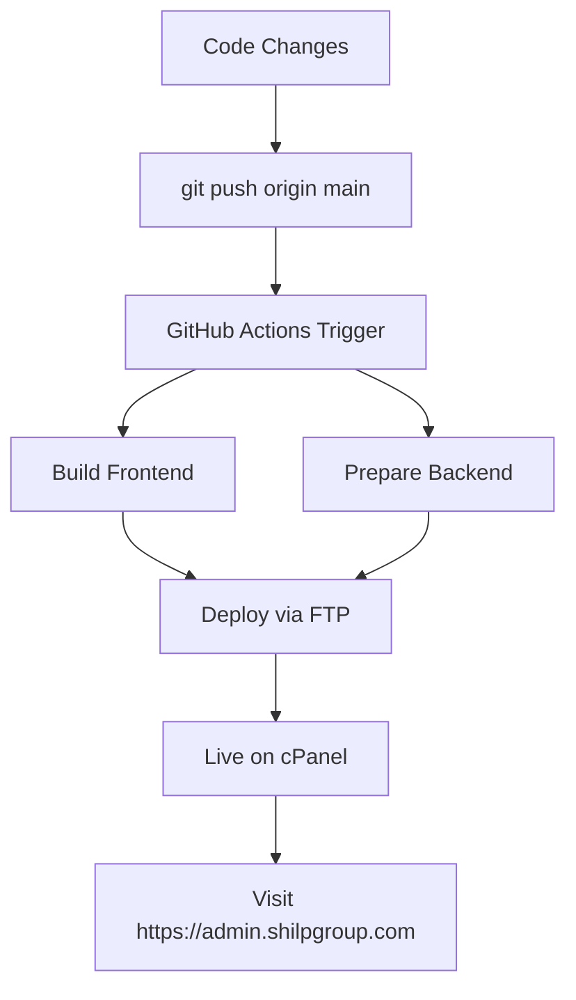

# 🔄 Git Auto-Deployment Setup for cPanel

## Method 1: cPanel Git Version Control (Easiest)

### Step 1: cPanel में Git Setup
1. **cPanel Login** करें
2. **Git Version Control** section में जाएं
3. **Create Repository** click करें

### Step 2: Repository Configuration
```
Repository Path: /home/username/git-repos/shilp-adminpanel
Clone URL: https://github.com/SandeepTech077/shilp-adminpanel.git
Branch: main
```

### Step 3: Deployment Path Setup
```
Frontend Deployment: /public_html/admin/
Backend Deployment: /home/username/mail.shilpgroup.com/
```

### Step 4: Auto-Deploy Hook बनाएं
cPanel में **Post-receive Hook** script:

```bash
#!/bin/bash
echo "🚀 Starting Auto-Deployment..."

# Variables
REPO_PATH="/home/username/git-repos/shilp-adminpanel"
FRONTEND_PATH="/public_html/admin"
BACKEND_PATH="/home/username/mail.shilpgroup.com"

# Go to repository
cd $REPO_PATH

# Build client
echo "📦 Building frontend..."
cd client
npm install
npm run build

# Deploy frontend
echo "📱 Deploying frontend..."
rsync -av dist/* $FRONTEND_PATH/
cp .htaccess $FRONTEND_PATH/

# Deploy backend
echo "🚀 Deploying backend..."
cd $REPO_PATH
rsync -av server/src/ $BACKEND_PATH/src/
cp server/package.json $BACKEND_PATH/
cp server/.env.production $BACKEND_PATH/.env

# Install backend dependencies
cd $BACKEND_PATH
npm install --production

echo "✅ Deployment Complete!"
```

---

## Method 2: GitHub Webhooks (Advanced)

### Step 1: cPanel में Webhook Handler बनाएं

1. **File Manager** में `/public_html/` में जाएं
2. **webhook.php** file बनाएं (use `cpanel-webhook.php` content)
3. **Webhook secret** set करें
4. **File permissions**: 644

### Step 2: cPanel में Deploy Script बनाएं

1. Home directory में **deploy.sh** file बनाएं
2. Content copy करें from `cpanel-deploy.sh`
3. **Make executable**: `chmod +x /home/username/deploy.sh`
4. **Update paths** according to your cPanel structure

### Step 3: GitHub Repository में Webhook Add करें

1. **GitHub Repository** → **Settings** → **Webhooks**
2. **Add webhook**:
   ```
   Payload URL: https://yourdomain.com/webhook.php
   Content type: application/json
   Secret: your-webhook-secret-here
   Events: Just the push event
   Active: ✓
   ```

### Step 4: Test Auto-Deployment

```bash
# Make any small change
echo "# Test auto-deployment" >> README.md
git add .
git commit -m "Test auto-deployment"
git push origin main

# Check deployment log
# /home/username/deployment.log
```

---

## Method 3: GitHub Actions FTP Deploy (Recommended - Easiest)

### Step 1: GitHub Repository Secrets Setup

1. **GitHub Repository** → **Settings** → **Secrets and variables** → **Actions**
2. **Add these secrets**:

```
FTP_SERVER: ftp.shilpgroup.com (या आपका FTP server)
FTP_USERNAME: your-cpanel-username
FTP_PASSWORD: your-cpanel-password  
CPANEL_USERNAME: your-cpanel-username
```

### Step 2: cPanel में Directories Setup

```bash
# Make sure these directories exist:
/public_html/admin/              # For frontend
/home/username/mail.shilpgroup.com/  # For backend
```

### Step 3: Test Auto-Deployment

```bash
# Make any change
echo "Testing auto-deployment" >> README.md
git add .
git commit -m "Test: Auto-deployment setup"
git push origin main
```

**Result**: 
- GitHub Actions automatically triggers
- Builds production files  
- Deploys via FTP to cPanel
- Your site goes live!

### Step 4: Check Deployment Status

1. **GitHub** → **Actions** tab
2. See real-time deployment progress
3. Check for any errors

### Step 5: Manual Node.js App Restart (if needed)

1. **cPanel** → **Node.js Apps** 
2. **Restart** application
3. Or run: `npm install && npm start`

---

## 🎯 Complete Workflow Summary:



---

## ⚡ Quick Setup Commands:

```bash
# 1. Setup FTP secrets in GitHub (manual step)

# 2. Test deployment
git add .
git commit -m "Setup auto-deployment"
git push origin main

# 3. Monitor deployment
# Check GitHub Actions tab

# 4. Access live site
# https://admin.shilpgroup.com
```

---

## 🔧 Troubleshooting:

### FTP Connection Issues:
```
❌ Invalid credentials → Check FTP_USERNAME/PASSWORD
❌ Server not found → Verify FTP_SERVER address
❌ Permission denied → Check directory permissions
```

### Deployment Issues:
```
❌ Files not updating → Clear browser cache
❌ API not working → Restart Node.js app in cPanel  
❌ Upload errors → Check file permissions (755)
```

---

## 🎉 Expected Result:

**After setup completion:**
1. ✅ Any `git push` → Automatic deployment
2. ✅ Frontend live: https://admin.shilpgroup.com
3. ✅ Backend live: https://mail.shilpgroup.com/api/health
4. ✅ Zero manual work after initial setup

**Login credentials:**
- Email: shilpgroup47@gmail.com
- Password: ShilpGroup@RealState11290